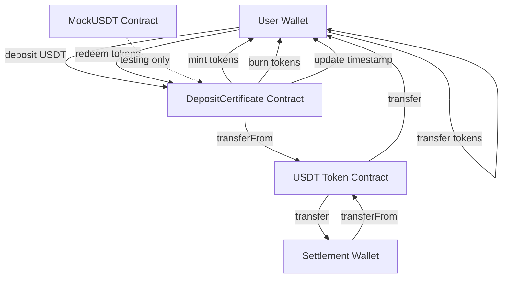

# Design Document

## Overview

The ERC-20 Deposit Certificate system consists of two main smart contracts: a MockUSDT contract for testing and the core DepositCertificate contract. The system implements a time-locked deposit mechanism where users deposit USDT, receive transferable ERC-20 certificate tokens, and can redeem them later with time-based penalties. The architecture prioritizes security through OpenZeppelin libraries, gas efficiency through immutable variables, and flexibility through proper access controls.

## Architecture

### System Components



### Contract Hierarchy

- **DepositCertificate**: Main contract inheriting from OpenZeppelin's ERC20 and Ownable
- **MockUSDT**: Testing contract inheriting from OpenZeppelin's ERC20
- **External Dependencies**: OpenZeppelin contracts for security and standards compliance

## Components and Interfaces

### DepositCertificate Contract

**State Variables:**

```solidity
IERC20 public immutable usdtToken;           // USDT contract reference
address public immutable settlementWallet;   // Multi-sig settlement wallet
mapping(address => uint256) public lastDepositTime; // Timestamp tracking per holder
```

**Core Functions:**

```solidity
function deposit(uint256 amount) external
function redeem(uint256 amount) external
function calculatePenalty(address holder, uint256 amount) public view returns (uint256 penalty, uint256 payout)
function _beforeTokenTransfer(address from, address to, uint256 amount) internal override
```

**Constructor Parameters:**

- `address _usdtToken`: Address of USDT contract (or MockUSDT for testing)
- `address _settlementWallet`: Address of the settlement wallet
- `string memory _name`: Name of the certificate token
- `string memory _symbol`: Symbol of the certificate token

### MockUSDT Contract

**Purpose**: Simulate USDT behavior for local development and testing

**Features:**

- 6 decimal places (matching real USDT)
- Mintable for testing purposes
- Standard ERC20 functionality
- Owner can mint tokens to any address for test setup

### Penalty Calculation Logic

**Time Periods and Rates:**

- 0 ≤ elapsed < 365 days: 50% penalty
- 365 days ≤ elapsed < 1825 days: Linear decrease from 50% to 0%
- elapsed ≥ 1825 days: 0% penalty

**Formula Implementation:**

```solidity
function calculatePenalty(address holder, uint256 amount) public view returns (uint256 penalty, uint256 payout) {
    uint256 elapsed = block.timestamp - lastDepositTime[holder];
    uint256 penaltyRate;

    if (elapsed < 365 days) {
        penaltyRate = 5000; // 50% in basis points
    } else if (elapsed >= 1825 days) {
        penaltyRate = 0;
    } else {
        // Linear decrease: 50% * (1 - (elapsed - 365 days) / 1460 days)
        uint256 timeInLinearZone = elapsed - 365 days;
        penaltyRate = 5000 - (5000 * timeInLinearZone) / (1460 days);
    }

    penalty = (amount * penaltyRate) / 10000;
    payout = amount - penalty;
}
```

## Data Models

### State Management

**Timestamp Tracking:**

- `mapping(address => uint256) lastDepositTime`: Maps each holder to their most recent deposit/transfer timestamp
- Updated on: initial deposit, token transfers (recipient only), not on burns
- Used for: penalty calculation during redemption

**Token Balances:**

- Inherited from OpenZeppelin ERC20
- Standard balance tracking with transfer functionality
- Hooks into `_beforeTokenTransfer` for timestamp updates

### Events

```solidity
event Deposited(address indexed user, uint256 usdtAmount, uint256 tokensIssued);
event Redeemed(address indexed user, uint256 tokensRedeemed, uint256 usdtPayout, uint256 penalty);
event TimestampUpdated(address indexed holder, uint256 newTimestamp);
```

## Error Handling

### Custom Errors

```solidity
error InsufficientBalance();
error InsufficientUSDTAllowance();
error InsufficientSettlementFunds();
error ZeroAmount();
error TransferFailed();
```

### Validation Patterns

1. **Input Validation**: Check for zero amounts, valid addresses
2. **Balance Checks**: Verify sufficient token balances before operations
3. **Allowance Verification**: Ensure proper USDT approvals exist
4. **SafeERC20 Usage**: Prevent issues with non-standard ERC20 implementations
5. **Reentrancy Protection**: Use OpenZeppelin's ReentrancyGuard if needed

### Failure Scenarios

- **Deposit Failures**: Insufficient USDT balance/allowance, settlement wallet issues
- **Redemption Failures**: Insufficient certificate tokens, settlement wallet lacks USDT/approval
- **Transfer Failures**: Standard ERC20 transfer validations

## Testing Strategy

### Unit Tests Structure

**Test Categories:**

1. **Deployment Tests**: Verify correct initialization and immutable variables
2. **Deposit Tests**: Test USDT transfer, token minting, timestamp recording
3. **Transfer Tests**: Verify timestamp updates on token transfers
4. **Penalty Calculation Tests**: Test all time periods and edge cases
5. **Redemption Tests**: Test token burning, USDT payout, penalty application
6. **Edge Case Tests**: Zero amounts, insufficient balances, approval issues

**Test Environment Setup:**

```solidity
contract DepositCertificateTest is Test {
    MockUSDT public usdt;
    DepositCertificate public certificate;
    address public settlementWallet;
    address public user1;
    address public user2;

    function setUp() public {
        // Deploy contracts, mint test USDT, set approvals
    }
}
```

**Time Manipulation:**

- Use Foundry's `vm.warp()` to simulate time passage
- Test penalty calculations at specific time intervals
- Verify timestamp updates work correctly

### Integration Tests

1. **Full Deposit-Transfer-Redeem Flow**: End-to-end user journey
2. **Multi-User Scenarios**: Multiple users with different deposit times
3. **Settlement Wallet Integration**: Test with actual multi-sig wallet behavior
4. **Gas Optimization**: Measure gas costs for all operations

### Deployment Testing

1. **Testnet Deployment**: Deploy to Goerli/Sepolia for integration testing
2. **Contract Verification**: Ensure Etherscan verification works
3. **Real USDT Integration**: Test with actual USDT contracts on testnet
4. **Multi-sig Integration**: Test with real multi-sig settlement wallet

## Security Considerations

### Access Controls

- Use OpenZeppelin's Ownable for administrative functions
- Immutable addresses prevent malicious updates
- No upgrade mechanisms to ensure predictable behavior

### External Dependencies

- OpenZeppelin contracts for battle-tested implementations
- SafeERC20 for secure token interactions
- No external oracles or complex dependencies

### Attack Vectors

- **Reentrancy**: Mitigated by following checks-effects-interactions pattern
- **Integer Overflow**: Solidity 0.8+ built-in protection
- **Front-running**: Penalty calculations are deterministic and time-based
- **Flash Loan Attacks**: Time-based penalties prevent immediate arbitrage

### Audit Recommendations

- Focus on penalty calculation logic
- Verify timestamp update mechanisms
- Test settlement wallet integration thoroughly
- Review all external contract interactions
